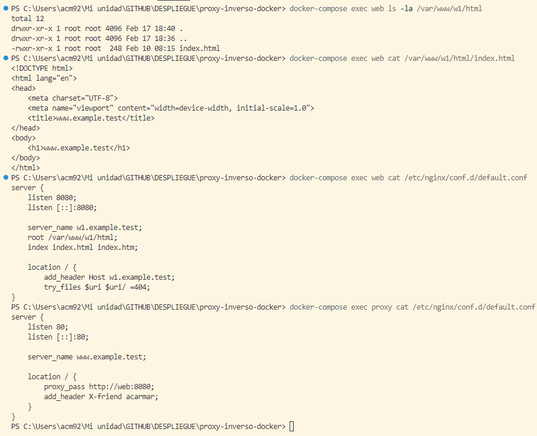

# Proxy Inverso

## Contenidos

- [Opción solo con compose](#opción-solo-con-compose)
  - [Modificación proxy/default](#modificación-proxydefault)  
  - [Archivo w1/default](#archivo-w1default)
  - [Creación docker-compose.yml](#creación-docker-composeyml)  
  - [Ejecución](#ejecución)
- [Opción docker-compose + Dockerfile](#opción-docker-compose--dockerfile)
- [Screenshot](#screenshot)

## Opción solo con compose

`docker pull nginx`

### Modificación archivo proxy/default

Se pone el nombre del contenedor del servicio en el archivo *files/proxy/default* que irá en la máquina *proxy*:
```bash
server {
    listen 80;
    listen [::]:80;

    server_name www.example.test;

    location / {
        proxy_pass http://web:8080;
        add_header X-friend acarmar;
    }
}
```

### Archivo w1/default

```bash
server {
    listen 8080;
    listen [::]:8080;

    server_name w1.example.test;
    root /var/www/w1/html; 
    index index.html index.htm;

    location / {
        add_header Host w1.example.test;
        try_files $uri $uri/ =404;
    }
}
```

### Creación docker-compose.yml

Contenido:
```yml
services:
  proxy:
    image: nginx:latest
    depends_on:
      - web
    ports:
      - "80:80"
    volumes:
      - ./files/proxy/default:/etc/nginx/conf.d/default.conf

  web:
    image: nginx:latest
    volumes:
      - ./files/w1/default:/etc/nginx/conf.d/default.conf
      - ./files/w1/index.html:/var/www/w1/html/index.html
```

### Ejecución

Ejecución de los contenedores:  
`docker-compose up -d`

Ver los logs:  
`docker-compose logs proxy`  
`docker-compose logs web`

Verificar configuración:
`docker-compose exec web ls -la /var/www/w1/html`
`docker-compose exec web cat /var/www/w1/html/index.html`
`docker-compose exec web cat /etc/nginx/conf.d/default.conf`
`docker-compose exec proxy cat /etc/nginx/conf.d/default.conf`

## Opción docker-compose + Dockerfile

Se crean los ficheros *Dockerfile.proxy* y *Dockerfile.w1* para crear y gestionar los contenedores.

*Dockerfile.proxy*:
```dockerfile
FROM nginx:latest
COPY files/proxy/default.conf /etc/nginx/conf.d/default.conf
EXPOSE 80
CMD ["nginx", "-g", "daemon off;"]
```

*Dockerfile.w1*:
```dockerfile
FROM nginx:latest
RUN mkdir -p /var/www/w1/html
COPY files/w1/default.conf /etc/nginx/conf.d/default.conf
COPY files/w1/index.html /var/www/w1/html/index.html
EXPOSE 8080
CMD ["nginx", "-g", "daemon off;"]
```

Se modifica el fichero *docker-compose.yml*:

```yml
services:
  proxy:
    build:
      context: .
      dockerfile: Dockerfile.proxy
    ports:
      - "80:80"
    depends_on:
      - web

  web:
    build:
      context: .
      dockerfile: Dockerfile.w1
    ports:
      - "8080:8080"
    networks:
      default:
        aliases:
          - web
```

## Screenshot

